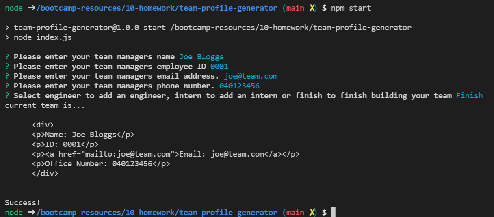

#Team Profile Generator

Summary

The team profile generator is a node application that collects team member details and generates a corresponding html report. The applicaiton utlises inqurier to collect team member information from the command line interface.

How to Use

To access the application code please see the repo link below. Once you have cloned the repo locally, please use npm to install dependencies. Then follow the instructions found in the following video tutorial.

https://drive.google.com/file/d/1IFpqWj7ZCDCi00_PMGvixOXL5glZSv6S/view

Technologies used

- HTML
- NODE JS
- Inqiurer NODE JS Library

Repo 

- Github Repo: https://github.com/Normksb/team-profile-generator

